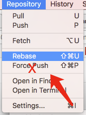

# mac下的git日常
只使用命令行的大神可以忽略这篇文章。  
为啥是mac下的git日常而不是git日常？主要是希望有好心人赞助几台windows和Linux电脑来

####下面正题
- 软件：gitbox、p4merge、Go2Shell、系统自带终端  

- 选取准则：简单、方便、实用。
    1. gitbox：我认为是最好用的git客户端，简单方便，没有之一。SourceTree或者其他一些客户端也都用过，没有gitbox这么简单粗暴。
    2. p4merge：解决冲突时使用的对比合并工具。有点类似以前windows中svn客户端乌龟的合并工具，简单明了。
    3. Go2Shell: 在Finder中当前目录点击Go2Shell，可以直接打开终端定位到当前目录下。    


- 安装配置：  
    gitbox、Go2Shell自行搜索安装即可。
    p4merge下载了将p4merge.app拖入应用程序目录。下面是p4merge的配置：在终端运行即可
    ```bash    
    git config --global mergetool.p4merge.cmd '/Applications/p4merge.app/Contents/MacOS/p4merge "$BASE" "$LOCAL" "$REMOTE" "$MERGED"'
    git config --global mergetool.p4merge.trustExitCode true #通知退出是否指示合并操作成功
    git config --global mergetool.keepBackup false #冲突解决后不备份冲突文件
    git config --global merge.tool p4merge
    ```


- 日常操作
    1. 新项目：直接用Go2Shell打开当前目录的下的终端"git clone git@bitbucket.org:fiattt/test.git test_jack"项目,将项目拖入gitbox即可。  
    test_jack目录名表示jack这个开发的工作空间。  
    同时再clone个"git clone git@bitbucket.org:fiattt/test.git test_tom"，  
    test_tom目录名表示tom这个开发的工作空间，方便后面来演示。  
    项目自带2个文本文件，每个文件内容2行文字。如图：
      

    2. 编写完成提交内容保存在本地仓库： gitbox中点击commit即可
      

    3. 查看状态及日志:  
    绿色点表示自己本地提交的代码，蓝色点表示服务器别人提交的代码。点击每行能具体显示变更的文件明细。  
    

    4. 提交到服务器：  
    rebase或者merge操作后push到服务器。建议使用rebase来做生成的日志方便查看     
        - rebase操作：  
    在项目上点击右键打开终端执行git rebase命令来操作。不要使用菜单中的Rebase,防止误触Force Push（不要问为什么，说多了都是泪）
    
    
      

        - pull merge操作：  
    直接点击pull按钮即可，pull merge会比rebase多个commit，不方便以后日志的查看
        

    5. 解决文件冲突（rebase和merge时有多个人在同一个commit后同时修改同一个文件会造成冲突）：  
    以rebase为例讲解冲突时的操作。  
    背景：  
    jack和tom二人同时修改了file001，都增加了一行文字。tom已经将修改提交到了服务器。jack将修改提交到了本地仓库。以jack为视角使用gitbox状态简明的表现如下：  
      

    jack在终端执行了git rebase命令冲突后，终端会提示冲突。并且对应gitbox的分支会由master变成了临时的2e5693bc7f2f：  
      

    切记：解决冲突的中间一定不要使用git commit提交代码。  
    下面来演示如何解决冲突：  
        - 直接命令行调出p4merge：git mergetool  
        1.点击蓝色或绿色icon来选择使用哪边的代码，按住shift点击可以同时使用2边的代码。  
        2.解决完毕后点击保存，点击关闭窗口退出。还有冲突文件的话系统会自动再打开个编辑框。
        3.完全关闭p4merge
          
        - 冲突解决完毕，点击Continue Rebase，继续rebase直到结束。中途遇到冲突使用git mergetool来解决
        
        - rebase完毕会自动回到原来的分支，push代码到服务器就好了
        

    解决冲突中出了啥问题想终止，如终端中提示的那样可以通过执行命令“git rebase --abort”放弃这次rebase,直接会回到执行"git rebase"前的状态

    6. 我反悔了，想撤销
        - 还未commit的代码：  
        
        - 代码只是提交到了本地仓库：直接gitbox中按"Ctrl + Z"即可，会自动撤销最近一次操作
        - 代码已经提交到了服务器  
            - 若是就一个人开发的话，直接gitbox中按"Ctrl + Z"即可，会自动撤销最近一次操作。  
            - 若是多人开发，确定下其他人没有提交新代码的话也能使用"Ctrl + Z"。不过大多情况下不适用，需要这么来操作：
            在需要撤销的commit上点右键，点击Revert Commit,会将生成一个该commit逆操作的提交对冲  
              
        - 撤销最近本地多个连续的commit，在撤销最早的那个commit上右键点击Reset Branch，完了后push代码
        
        - 撤销最近多个连续的commit中若包含服务器上的commit的话，Reset Branch完了后可以使用Force Push提交代码（慎用）

- 进阶操作
    1. 命令行里老是提示“Enter passphrase for key”。  
    编辑文件~/.ssh/config添加：  
    ```
    Host *
    UseKeychain yes
    ```
    2. 将另一分支中某次或多次提交应用到当前分支中：  
    注意：当执行完 cherry-pick 以后，将会生成一个新的提交；这个新的提交的哈希值和原来的不同，但标识名一样  
    命令行执行：git cherry-pick <commit id>即可  
    或者gitbox中鼠标点点也可以，下面示例是将服务器上branch_001分支中一个commit应用到本地  
    

    3. 找到各种操作不当造成的commit丢失  
    知晓一个概念：代码只要commit到了本地仓库就不会丢掉，除非你把整个目录删掉了- -！  
    一些误操作导致log中查看不到了某些commit该咋办?
    命令行语句如下：
    ```sh
    git fsck --lost-found |grep commit |awk -F " " '{print "git log " $3 " -1 --pretty=\"format:%h %s %ai\" "}' |/bin/bash
    ```
    核心命令是：git fsck --lost-found
后面加的一大撮啥的是把时间和日志显示出来方便查找。  
详解如下：  
grep commit 筛选丢失的commit提交  
awk -F " " 以空格" "分割，$3是分割的第3列。  
打印拼接字符串"git log " $3 " -1 --pretty=\"format:%h %s %ai\" "  
/bin/bash通道将凭借的字符串执行  
见图：

找到了commit值后拉分支来合并或者git cherry-pick都行  
